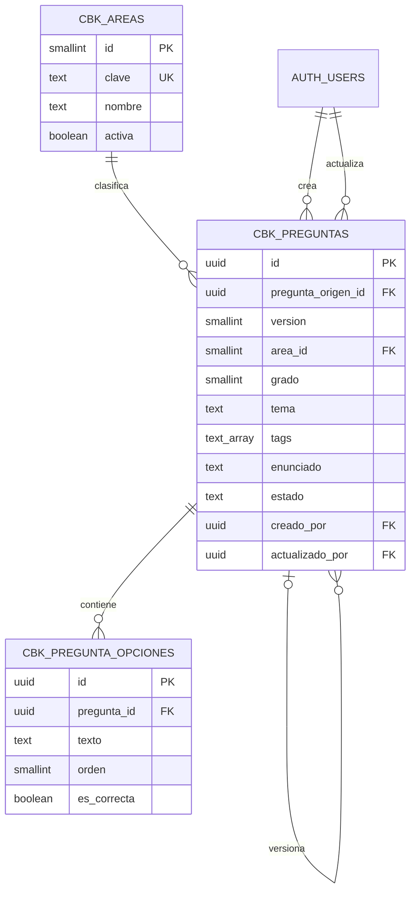

# Cloudbook

Documentación técnica y funcional del módulo. Estado verificado el **26 de septiembre de 2026** contra el código del repositorio y el proyecto Supabase `thrunius`.

## 1. Propósito

Cloudbook es un banco de preguntas escolares reutilizable. La primera etapa busca permitir que:

- administradores y editores gestionen preguntas y opciones;
- las preguntas se clasifiquen por área, grado, tema y etiquetas (`tags`);
- cualquier usuario autenticado practique con preguntas aleatorias;
- la respuesta correcta no sea revelada al navegador antes de responder;
- el contenido pueda prepararse en JSON, revisarse y luego importarse mediante SQL.

En esta fase solo se admite el tipo de pregunta `seleccion_unica`. Cada pregunta generada tiene cuatro opciones y una respuesta correcta.

## 2. Estado actual

| Componente | Estado |
| --- | --- |
| Modelo de datos de áreas, preguntas y opciones | Implementado en Supabase |
| RLS y reglas por rol | Implementadas |
| Validaciones de integridad mediante constraints, índices y triggers | Implementadas |
| Clasificación por `tags` | Implementada en base de datos |
| Bancos de Inglés y Matemáticas para grado 2 | Generados e importados |
| RPC para obtener y calificar preguntas | Implementadas |
| Vista para responder preguntas | Funcional y adaptada a móvil |
| Filtro por área y grado | Funcional |
| Seguimiento local de respuestas correctas | Funcional en el navegador |
| CRUD de áreas | Archivo inicial creado, todavía sin implementación |
| Listado/CRUD de preguntas | Archivo inicial creado, todavía sin implementación |
| Flujo editorial para publicar preguntas | Pendiente |
| Historial de intentos en Supabase | Pendiente; por ahora solo existe en `localStorage` |

### Contenido cargado actualmente

| Área | Grado | Estado | Preguntas | Opciones |
| --- | ---: | --- | ---: | ---: |
| Inglés | 2 | `borrador` | 50 | 200 |
| Matemáticas | 2 | `borrador` | 50 | 200 |
| **Total** |  |  | **100** | **400** |

Las cinco áreas del catálogo están activas: Lenguaje, Ciencias Naturales, Matemáticas, Ciencias Sociales e Inglés. Por ahora solo Inglés y Matemáticas tienen preguntas.

## 3. Arquitectura general

```text
Archivos JSON de contenido
        │
        ▼
Scripts SQL de importación
        │
        ▼
Supabase: cbk_areas ── cbk_preguntas ── cbk_pregunta_opciones
        │
        ▼
RPC públicas → funciones privadas con SECURITY DEFINER
        │
        ▼
ResponderPregunta.vue
        │
        └── progreso local por usuario + área + grado
```

El frontend usa Vue 3, Vue Router, Bootstrap 5, Vue Toastification y el cliente de Supabase definido en `src/lib/supabase.js`. La conexión usa variables `VITE_SUPABASE_URL` y `VITE_SUPABASE_PUBLISHABLE_KEY`; nunca debe utilizarse una clave `service_role` en el navegador.

## 4. Modelo de datos

### Relaciones



Todas las claves foráneas relevantes usan `ON DELETE RESTRICT`. Esto evita borrar un área con preguntas, una pregunta con opciones, una pregunta usada como origen de otra versión o un usuario referenciado como autor.

### `public.cbk_areas`

Catálogo relacional de áreas académicas.

| Campo | Tipo | Regla o propósito |
| --- | --- | --- |
| `id` | `smallint` | Clave primaria. No debe asumirse desde el frontend. |
| `clave` | `text` | Slug único, por ejemplo `matematicas`; solo minúsculas y guion bajo. |
| `nombre` | `text` | Nombre visible, obligatorio y no vacío. |
| `descripcion` | `text` | Descripción opcional. |
| `orden` | `smallint` | Orden de presentación, positivo y único. |
| `activa` | `boolean` | Indica si puede usarse para nuevos entrenamientos. Valor inicial `true`. |
| `creado_en` | `timestamptz` | Fecha de creación. |
| `actualizado_en` | `timestamptz` | Fecha de última actualización. |

La identidad formada por `id`, `clave` y `creado_en` es inmutable. No existe política de eliminación desde el cliente; una área se desactiva en lugar de borrarse.

### `public.cbk_preguntas`

Contiene el enunciado, clasificación, trazabilidad y estado editorial de cada pregunta.

| Campo | Tipo | Regla o propósito |
| --- | --- | --- |
| `id` | `uuid` | Clave primaria; por defecto `gen_random_uuid()`. |
| `pregunta_origen_id` | `uuid` | Referencia opcional a la primera versión de la pregunta. |
| `version` | `smallint` | `1` para una pregunta original; mayor que `1` si existe origen. |
| `area_id` | `smallint` | FK a `cbk_areas.id`. |
| `grado` | `smallint` | Grado escolar entre `1` y `11`; valor inicial `2`. |
| `tema` | `text` | Tema general legible, por ejemplo `Tablas de multiplicar`. |
| `competencia` | `text` | Habilidad o competencia evaluada. |
| `enunciado` | `text` | Texto obligatorio de la pregunta. |
| `contexto` | `text` | Situación o información previa opcional. |
| `recurso_ruta` | `text` | Ruta opcional de una imagen o audio. |
| `tipo_recurso` | `text` | `imagen`, `audio` o `null`; debe ser coherente con `recurso_ruta`. |
| `tipo` | `text` | Actualmente solo `seleccion_unica`. |
| `dificultad` | `smallint` | `1` fácil, `2` media, `3` difícil. |
| `explicacion` | `text` | Retroalimentación mostrada después de responder. |
| `procedencia` | `text` | `propia`, `adaptada` o `externa`. |
| `fuente_nombre` | `text` | Fuente opcional. |
| `fuente_url` | `text` | URL opcional de la fuente. |
| `licencia` | `text` | Licencia opcional del contenido. |
| `estado` | `text` | `borrador`, `publicada` o `retirada`. |
| `creado_por` | `uuid` | FK a `auth.users.id`; por defecto `auth.uid()`. |
| `actualizado_por` | `uuid` | FK a `auth.users.id`; por defecto `auth.uid()`. |
| `creado_en` | `timestamptz` | Fecha de creación. |
| `actualizado_en` | `timestamptz` | Fecha de última actualización. |
| `publicado_en` | `timestamptz` | Fecha reservada para el flujo de publicación. |
| `tags` | `text[]` | Etiquetas temáticas específicas; por defecto arreglo vacío. |

Los `tags` complementan a `tema`: `tema` describe una categoría general y `tags` permite aplicar varios filtros específicos a la vez. Cada tag debe ser único dentro del arreglo, tener máximo 64 caracteres y usar formato slug con minúsculas, números y guiones, por ejemplo `tabla-3` o `numeros-1-20`. Existe un índice GIN para futuras consultas por etiquetas.

### `public.cbk_pregunta_opciones`

| Campo | Tipo | Regla o propósito |
| --- | --- | --- |
| `id` | `uuid` | Clave primaria; por defecto `gen_random_uuid()`. |
| `pregunta_id` | `uuid` | FK a `cbk_preguntas.id`. |
| `texto` | `text` | Texto obligatorio y no vacío. |
| `orden` | `smallint` | Posición positiva de la opción. |
| `es_correcta` | `boolean` | Marca la respuesta correcta; valor inicial `false`. |
| `creado_en` | `timestamptz` | Fecha de creación. |
| `actualizado_en` | `timestamptz` | Fecha de última actualización. |

La combinación `(pregunta_id, orden)` es única. Un índice único parcial sobre `pregunta_id WHERE es_correcta` impide que una pregunta tenga más de una opción correcta. Todavía no existe un flujo de publicación que exija automáticamente al menos dos opciones y exactamente una correcta; esa validación sigue pendiente.

## 5. Reglas de integridad y ciclo editorial

Además de constraints e índices, las tres tablas usan triggers del esquema privado:

- `privado.cbk_validar_area()`: conserva la identidad del área, limpia el nombre y actualiza fechas.
- `privado.cbk_validar_pregunta()`: protege identidad, versión, autoría y fechas; solo permite eliminar borradores; bloquea la edición del contenido publicado y evita reactivar preguntas retiradas.
- `privado.cbk_validar_pregunta_opcion()`: solo permite crear, editar o eliminar opciones mientras la pregunta está en borrador y sea de selección única.
- `privado.cbk_tags_validos(text[])`: valida formato, longitud y ausencia de tags duplicados.

La publicación directa está bloqueada actualmente con el error `CBK_PUBLICACION_PENDIENTE_VALIDAR_OPCIONES`. La intención es incorporar una operación controlada que, antes de publicar, compruebe cantidad de opciones, existencia de una única correcta, explicación y fecha de publicación.

## 6. Seguridad y RLS

RLS está activo en las tres tablas.

| Operación | `admin` | `editor` | `subscriber` |
| --- | :---: | :---: | :---: |
| Leer áreas | Sí | Sí | Sí |
| Crear o editar áreas | Sí | No | No |
| Eliminar áreas desde el cliente | No | No | No |
| Leer preguntas y opciones directamente | Sí | Sí | No |
| Crear o editar preguntas y opciones | Sí | Sí | No |
| Eliminar preguntas | Solo borradores | Solo borradores | No |
| Responder mediante RPC | Sí | Sí | Sí |

Las políticas usan `get_my_role()` y el rol guardado en el perfil del usuario. En las inserciones de preguntas, `creado_por` y `actualizado_por` deben coincidir con `auth.uid()`; al actualizar, `actualizado_por` debe corresponder al usuario autenticado.

Los suscriptores no necesitan acceso directo a `cbk_preguntas` ni a `cbk_pregunta_opciones`. La práctica se realiza mediante funciones RPC limitadas, lo que evita exponer `es_correcta`.

## 7. Funciones RPC de práctica

El archivo `public/content/cloudbook/preguntas/202609_responder_preguntas.sql` define dos endpoints públicos y sus implementaciones privadas.

### `public.cbk_obtener_pregunta_aleatoria`

Parámetros:

```text
p_area_clave text
p_grado smallint
p_excluir_id uuid = null
```

Comportamiento:

1. exige un usuario autenticado;
2. valida que el grado esté entre 1 y 11;
3. exige que el área exista y esté activa;
4. filtra por área, grado, tipo `seleccion_unica` y estado disponible;
5. intenta dejar la pregunta anterior al final de la selección aleatoria;
6. devuelve `id`, tema, competencia, enunciado, contexto, dificultad, estado y opciones;
7. devuelve de cada opción únicamente `id`, `texto` y `orden`, nunca `es_correcta`.

Durante esta primera prueba acepta preguntas en estado `borrador` o `publicada`. Cuando exista el flujo editorial estable, el filtro debe restringirse a `q.estado = 'publicada'`.

### `public.cbk_calificar_respuesta`

Parámetros:

```text
p_pregunta_id uuid
p_opcion_id uuid
p_area_clave text
p_grado smallint
```

La función valida que la opción pertenezca a la pregunta y que la pregunta corresponda al área y grado solicitados. Solo entonces devuelve:

```json
{
  "correcta": true,
  "explicacion": "Retroalimentación de la pregunta"
}
```

Las implementaciones con `SECURITY DEFINER` viven en el esquema no expuesto `privado`, tienen `search_path` vacío y comprueban `auth.uid()`. Las funciones del esquema `public` son wrappers `SECURITY INVOKER`. Se retiró el permiso de ejecución a `PUBLIC` y `anon`; solo `authenticated` puede utilizarlas.

## 8. Vista de resolución de preguntas

### Rutas

```text
/cloudbook/responder
/cloudbook/responder/:area/:grado
```

La ruta corta redirige a `/cloudbook/responder/ingles/2`. Un ejemplo para Matemáticas es:

```text
/cloudbook/responder/matematicas/2
```

Vue Router valida el área contra `CBK_AREAS` y el grado como entero entre 1 y 11. Una combinación inválida vuelve a Inglés de grado 2. Ambas rutas requieren sesión, pero no restringen el rol.

### `ResponderPregunta.vue`

Flujo de la vista:

1. valida la configuración de Supabase y obtiene el usuario autenticado;
2. toma área y grado desde la URL;
3. carga el progreso local de esa combinación;
4. solicita una pregunta aleatoria mediante RPC;
5. mezcla el orden visual de las opciones en el navegador;
6. el usuario selecciona una opción y presiona **Enviar respuesta**;
7. la RPC califica la selección en el servidor;
8. la vista muestra si fue correcta o incorrecta y presenta la explicación;
9. actualiza el contador local y permite cargar la siguiente pregunta.

La interfaz incluye selectores de área y grado que actualizan la URL, estadísticas de respondidas, correctas y porcentaje de aciertos, y un botón para reiniciar el contador. Está diseñada primero para móvil, utiliza controles táctiles amplios y respeta `prefers-reduced-motion`.

El progreso se guarda únicamente en el navegador con esta separación lógica:

```text
cloudbook:responder:progreso:v1:<usuario_id>:<area>:<grado>
```

Por tanto, el contador no se sincroniza entre dispositivos, navegadores ni sesiones privadas, y limpiar los datos del navegador lo elimina.

## 9. Catálogos del frontend

`src/constants/catalogs/cloudbook.js` centraliza claves y etiquetas para:

- áreas;
- tipo y estado de pregunta;
- procedencia;
- tipo de recurso;
- dificultad.

Las claves son valores estables para lógica y persistencia; las etiquetas son textos visibles. En particular:

- `area_id` siempre se resuelve desde `cbk_areas`; no se deben inventar IDs en el frontend;
- `dificultad` se guarda como `1`, `2` o `3`;
- `tipo`, `estado`, `procedencia` y `tipo_recurso` guardan claves, no etiquetas;
- para ausencia de recurso se usa `null`.

## 10. Generación y almacenamiento de preguntas

Los artefactos de contenido están en `public/content/cloudbook/preguntas/`:

| Archivo | Propósito |
| --- | --- |
| `202609_preguntas_ingles.json` | Fuente revisable de 50 preguntas de Inglés. |
| `202609_preguntas_ingles.sql` | Importación de preguntas y opciones de Inglés. |
| `202609_preguntas_matematicas.json` | Fuente revisable de 50 preguntas de Matemáticas. |
| `202609_preguntas_matematicas.sql` | Importación de preguntas, tags y opciones de Matemáticas. |
| `202609_responder_preguntas.sql` | Instalación o actualización de las RPC de práctica. |

### Estructura del JSON

Cada archivo tiene dos propiedades raíz:

```json
{
  "metadatos": {
    "tabla_destino": "public.cbk_preguntas",
    "tabla_opciones_destino": "public.cbk_pregunta_opciones",
    "area_clave": "matematicas",
    "area_id_verificado": 3,
    "grado": 2,
    "cantidad": 50,
    "estado": "borrador"
  },
  "preguntas": []
}
```

Cada elemento de `preguntas` replica los campos importables de `cbk_preguntas` e incorpora un arreglo anidado `opciones`. Para contenido nuevo se recomienda esta forma:

```json
{
  "pregunta_origen_id": null,
  "version": 1,
  "area_id": 3,
  "grado": 2,
  "tema": "Tablas de multiplicar",
  "tags": ["tabla-3", "multiplicacion"],
  "competencia": "Resuelve problemas de grupos iguales",
  "enunciado": "Hay 2 bolsas con 3 canicas en cada una. ¿Cuántas hay?",
  "contexto": null,
  "recurso_ruta": null,
  "tipo_recurso": null,
  "tipo": "seleccion_unica",
  "dificultad": 1,
  "explicacion": "2 × 3 = 6.",
  "procedencia": "propia",
  "fuente_nombre": null,
  "fuente_url": null,
  "licencia": null,
  "estado": "borrador",
  "opciones": [
    { "texto": "6", "orden": 1, "es_correcta": true },
    { "texto": "5", "orden": 2, "es_correcta": false },
    { "texto": "9", "orden": 3, "es_correcta": false },
    { "texto": "3", "orden": 4, "es_correcta": false }
  ]
}
```

### Banco de Inglés

- 50 preguntas para grado 2, edad referencial de 7 a 8 años en Colombia.
- Cuatro opciones por pregunta y una correcta.
- Temas: saludos, cortesía, información personal, números, colores, formas, familia, cuerpo, aula, animales, alimentos, ropa, clima, días y rutinas, entre otros.
- Estado de importación: `borrador`.
- En Supabase las 50 preguntas ya tienen tags temáticos. Sin embargo, el JSON actual de Inglés todavía no contiene la propiedad `tags`; debe sincronizarse antes de usarlo como fuente definitiva para una nueva importación.

### Banco de Matemáticas

- 50 problemas sencillos de multiplicación para grado 2.
- 25 preguntas con `tabla-3` y 25 con `tabla-5`.
- Todas incluyen el tag general `multiplicacion`.
- Cuatro opciones y una correcta por pregunta.
- Estado de importación: `borrador`.

### Convenciones para nuevos bancos

- Usar nombres de archivo `AAAAMM_preguntas_<area>.json` y `.sql`.
- Confirmar `area_id` en `cbk_areas`, sin inferirlo desde el catálogo local.
- Usar cuatro opciones numeradas desde `1` y exactamente una correcta.
- Incluir explicación pedagógica breve.
- Usar tags slug, específicos y no duplicados.
- Mantener preguntas nuevas como `borrador`.
- Usar UUID deterministas en el SQL si se necesita reejecución segura.
- Importar preguntas antes que opciones por la relación FK.
- Ejecutar toda la carga dentro de una transacción.
- Verificar cantidades después de importar.

Los scripts actuales usan UUID deterministas y `ON CONFLICT (id) DO NOTHING`, por lo que pueden reejecutarse sin duplicar esos IDs. Requieren un `v_actor` que exista en `auth.users` y `profiles`; al ejecutarlos mediante la API debe coincidir con `auth.uid()` y tener rol `admin` o `editor`. En el SQL Editor deben revisarse cuidadosamente el actor, el área y los conteos antes y después de la carga.

## 11. Archivos y vistas del módulo

```text
src/
├── constants/catalogs/cloudbook.js
├── router/index.js
└── views/cloudbook/
    ├── cloudbook_docs.md
    ├── areas/CrudAreas.vue             # pendiente
    ├── preguntas/PreguntasLista.vue    # pendiente
    └── responder/ResponderPregunta.vue # funcional

public/content/cloudbook/preguntas/
├── 202609_preguntas_ingles.json
├── 202609_preguntas_ingles.sql
├── 202609_preguntas_matematicas.json
├── 202609_preguntas_matematicas.sql
└── 202609_responder_preguntas.sql
```

## 12. Próximos pasos recomendados

1. Sincronizar los tags del banco de Inglés hacia su JSON fuente.
2. Implementar el listado y CRUD de preguntas para `admin` y `editor`.
3. Implementar la administración de áreas solo para `admin`.
4. Crear una RPC de publicación que valide opciones, respuesta correcta, explicación y fechas de forma atómica.
5. Cambiar la RPC de práctica para aceptar únicamente preguntas `publicada` cuando finalice la revisión editorial.
6. Añadir filtros opcionales por `tema`, `tags` y dificultad.
7. Crear tablas de intentos o sesiones si se requiere progreso persistente y sincronizado.
8. Añadir pruebas de RLS, RPC y reglas de publicación.
9. Revisar accesibilidad con usuarios infantiles y probar la experiencia en teléfonos de baja resolución.

## 13. Criterios de seguridad que deben conservarse

- No consultar `es_correcta` desde la vista de práctica.
- Calificar siempre en el servidor.
- Mantener las funciones `SECURITY DEFINER` en un esquema no expuesto y con `search_path` explícito.
- No otorgar lectura directa de preguntas u opciones a `subscriber` si la práctica puede resolverse por RPC.
- Validar el rol tanto en RLS como en la interfaz de administración.
- No exponer claves secretas de Supabase en Vite.
- No permitir cambios de contenido después de publicar; crear una nueva versión en su lugar.
